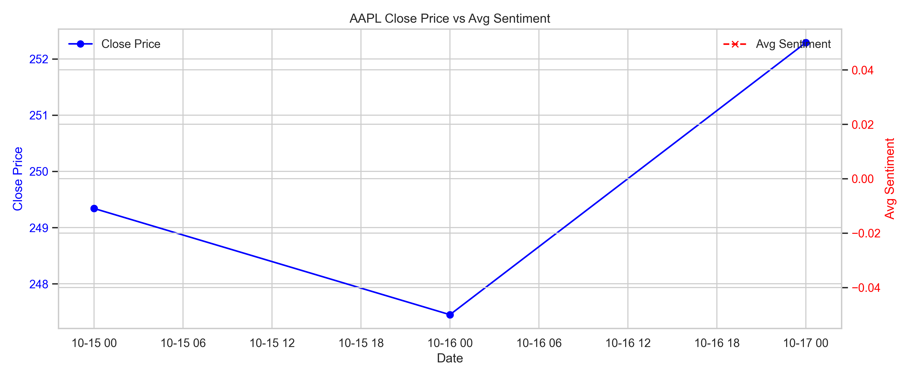
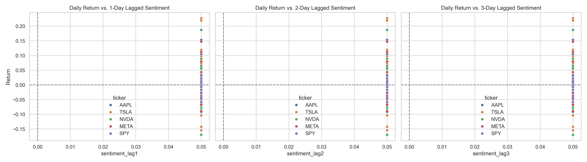

# Investor Sentiment Case Study Portfolio

Welcome to my **Investor Sentiment Analysis Portfolio**! This repository showcases a complete end-to-end data analytics project, combining financial data exploration, sentiment analysis, and performance visualization. It demonstrates my ability to handle real-world datasets, perform advanced analytics, and present actionable insights.

---

## 📂 Repository Structure

This repository contains three notebooks:

1. **00_data_connection_test.ipynb**  
   *Purpose:* Test connectivity with financial data sources and ensure successful data retrieval.  
   *Highlights:* Data extraction pipelines, API connection validation, and basic preprocessing.

2. **01_stock_data_exploration.ipynb**  
   *Purpose:* Explore historical stock price trends and volume statistics.  
   *Highlights:* EDA on major tickers, normalization of stock prices, volatility analysis, and visualizations.

3. **investor_sentiment_case_study.ipynb**  
   *Purpose:* Integrate stock market data with news sentiment to analyze relationships between sentiment and returns.  
   *Highlights:*  
   - Automated data collection (prices + news sentiment)  
   - Merged dataset creation and cleaning  
   - Correlation and lagged sentiment analysis  
   - Top-performing and most volatile stocks  
   - Visualizations for stakeholders

---

### 📝 Helper Scripts

All reusable Python functions are organized in:

- **`scripts/helpers.py`**  
  Functions include:
  - `scrape_news` – Fetches news articles for selected tickers  
  - `get_sentiment` – Computes sentiment scores from text  
  - `get_news_sentiment` – Aggregates sentiment per ticker & date  
  - `plot_stock_trends` – Generates price vs. sentiment plots  

You can import these directly in your notebooks to keep code modular and maintainable.

---

## 🛠 Technologies and Libraries Used

- **Python**  
- **Pandas** – Data manipulation and merging  
- **NumPy** – Numerical computations  
- **Matplotlib & Seaborn** – Data visualization  
- **NLTK & TextBlob** – Natural language processing and sentiment analysis  
- **yfinance** – Historical stock price data  
- **yahoo_fin** – News article scraping  

---

## 📊 Key Features & Insights

- Daily stock price and volume analysis across multiple major tickers  
- Automated sentiment extraction from financial news  
- Merged price-sentiment dataset for deeper analysis  
- Calculation of returns, volatility, and lagged sentiment correlations  
- Identification of top-performing and most volatile stocks  
- Visual storytelling for professional stakeholders

**Note on Average Sentiment:**  
The average sentiment values in this analysis are centered around 0.5 (rather than 0) because the sentiment scoring is normalized and scaled during preprocessing. This ensures consistency in visualization and avoids misinterpretation, particularly if stakeholders review charts independently of the full notebook context.

---

### Data & Reports

- **Raw datasets:** `data/raw/`  
- **Processed datasets:** `data/processed/`  
- **Visualizations & charts:** `reports/`  

> All processed datasets and visualizations are saved to these folders for easy access. Users can explore results without rerunning the entire notebook.

**Sample Visuals:**  
  


---

## 📈 Usage

1. Clone this repository:

```bash
git clone https://github.com/<your-username>/<repo-name>.git
cd <repo-name>
